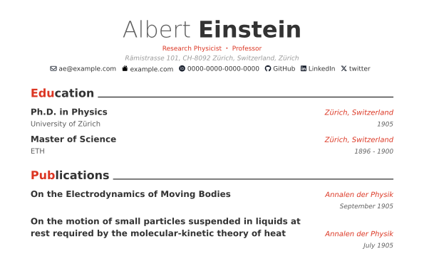

# typstcv

<!-- badges: start -->

<a href="https://kazuyanagimoto.r-universe.dev"></a>
[](https://github.com/kazuyanagimoto/typstcv/actions/workflows/R-CMD-check.yaml)
<a href = "https://github.com/kazuyanagimoto/typstcv/blob/main/LICENSE.md" target = "_blank"></a>
[](https://kazuyanagimoto.com/typstcv/index.html)
<!-- badges: end -->



This package provides helper functinons for
[kazuyanagimoto/quarto-awesomecv-typst](https://github.com/kazuyanagimoto/quarto-awesomecv-typst).
This work are inspired by these three works:

-   Byungjin Park’s [Awesome-CV](https://github.com/posquit0/Awesome-CV)
    -   A beautiful LaTeX template of CV
-   Paul Tsouchlos’s
    [modern-cv](https://typst.app/universe/package/modern-cv/)
    -   A [Typst](https://typst.app) implementation of Awesome-CV
-   Mitchell O’Hara-Wild and Rob Hyndman’s
    [vitae](https://pkg.mitchelloharawild.com/vitae/)
    -   R package for modern CV, including Awesome-CV

## Installation

You can install the development version of typstcv from R-universe with:

``` r
install.packages("typstcv", repos = "https://kazuyanagimoto.r-universe.dev")
```

## Usage

You can find a simple
[example](https://kazuyanagimoto.com/typstcv/vignettes/awesomecv/awesomecv.pdf)
and
[qmd](https://github.com/kazuyanagimoto/typstcv/blob/main/vignettes/awesomecv/awesomecv.qmd)
code.

### Use Template

You can use the template with `quarto` command.

``` bash
quarto use template kazuyanagimoto/quarto-awesomecv-typst
```

### YAML


Set author information in YAML.

``` yaml
author:
  firstname: Albert
  lastname: Einstein
  address: "Rämistrasse 101, CH-8092 Zürich, Switzerland, Zürich"
  position: "Research Physicist・Professor"
  contacts:
    - icon: fa envelope
      text: ae@example.com
      url: "mailto:ae@example.com"
    - icon: PATH_TO_ICON/icon.svg
      text: example.com
      url: https://example.com
```

-   [fontawesome](https://fontawesome.com/search?m=free&o=r) icons are
    supported via
    [duskmoon314/typst-fontawesome](https://github.com/duskmoon314/typst-fontawesome)
    with `fa` prefix.
-   SVG icons can be used by specifying the path to the icon file

### Fonts & Color

You can set fonts and the accent color in YAML.

``` yaml
style:
   color-accent: "516db0"
   font-header: "Roboto"
   font-text: "Source Sans Pro"
format:
  awesomecv-typst:
    font-paths: ["PATH_TO_FONT"]
```

### Resume Entries

`resume_entry()` is a helper function to create resume entryies from a
data frame.

``` r
educ
#>               title            location        date          description
#> 1  Ph.D. in Physics Zürich, Switzerland        1905 University of Zürich
#> 2 Master of Science Zürich, Switzerland 1896 - 1900                  ETH
```

``` r
educ |>
  resume_entry(
    title = "title",
    location = "location",
    date = "date",
    description = "description"
)
```


You can add bullet points by `details` argument.

``` r
resume_entry(award, details = c("detail1", "detail2"))
# resume_entry(award, details = grep("^detail", names(award)))
```


### Date Formatter

`date_formatter()` is a helper function to format dates in the resume.

``` r
work
#>                 title            location      start        end
#> 1 Technical Assistant   Bern, Switzerland 1902-01-01 1908-01-01
#> 2    Junior Professor   Bern, Switzerland 1908-01-01 1909-01-01
#> 3 Associate Professor Zürich, Switzerland 1909-01-01 1911-01-01
#>             description
#> 1 Federal Patent Office
#> 2    University of Bern
#> 3  University of Zürich
```

``` r
work |>
  format_date(
    start = "start",
    end = "end",
    date_format = "%Y",
    sep = "->",
    sort_by = "start"
  ) |>
  resume_entry()
```


